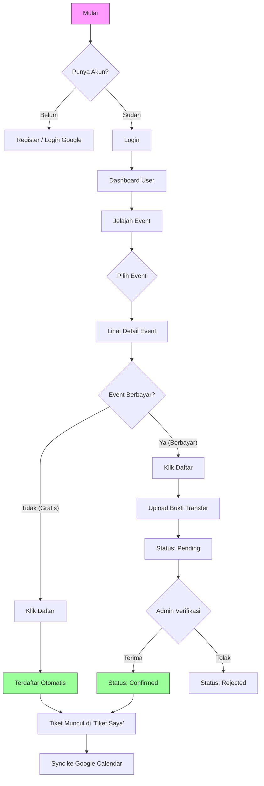

# 📘 Dokumen 1: Project Overview (Gambaran Umum)
## EventKu - Sistem Manajemen Event Mahasiswa Modern

> **Navigasi Dokumentasi**:
> [🏠 Home](../README.md) | [⚙️ Setup & Install](00_SETUP_AND_INSTALLATION.md) | [📂 Struktur Folder](02_FOLDER_STRUCTURE.md) | [🏗️ Repo-Service Pattern](05_SERVICE_REPOSITORY_PATTERN.md) | [🗄️ Database](06_DATABASE_SCHEMA.md)

---

> **Versi Dokumen**: 2.1 (Updated)
> **Status Project**: Production Ready
> **Technology**: Native PHP (OOP) + MySQL

---

### 1. 🌟 Latar Belakang & Tujuan
**EventKu** diciptakan untuk memecahkan masalah umum di kampus: **Penyebaran informasi event yang berantakan**. Mahasiswa sering ketinggalan info seminar atau lomba karena poster fisik hilang atau tertumpuk di grup chat.

**Tujuan Utama Sistem:**
1.  **Sentralisasi**: Satu tempat untuk SEMUA info event kampus.
2.  **Kemudahan Daftar**: Tidak perlu lagi isi Google Form manual berulang-ulang.
3.  **Real-time Update**: Kuota, status bayar, dan jadwal tersinkronisasi otomatis.
4.  **Paperless**: Tiket digital dan verifikasi online.

---

### 2. 🎡 Alur Pengguna (User Flow)

Berikut adalah diagram bagaimana User berinteraksi dengan sistem EventKu:

---

### 3. 🛠️ Spesifikasi Teknis (Tech Stack Detail)

Project ini dibangun dengan standar industri terkini untuk memastikan performa dan keamanan.

#### A. Backend (Sisi Server)
*   **Bahasa**: PHP 8.0 atau lebih baru.
    *   *Kenapa PHP Native?* Untuk performa maksimal tanpa overhead framework berat, sambil tetap menerapkan konsep OOP yang rapi.
*   **Database**: MySQL / MariaDB (Relational Database).
    *   Menggunakan engine InnoDB untuk support transaksi (penting saat rebutan kuota event).
*   **Security Libraries**:
    *   `bcrypt`: Standar hashing password (tidak bisa di-crack murni).
    *   `PDO`: Koneksi database anti SQL Injection.

#### B. Frontend (Sisi Tampilan)
*   **Framework CSS**: Bootstrap 5.3 (Responsive Mobile-First).
*   **Custom CSS**: Glassmorphism UI (Efek kaca transparan modern).
*   **Icons**: Bootstrap Icons (Ringan & Vektor).
*   **Maps**: Leaflet JS + OpenStreetMap (Gratis, tidak butuh kartu kredit seperti Google Maps).

#### C. Integrasi Pihak Ketiga (API)
*   **Google OAuth 2.0**: Memungkinkan user login pakai akun Gmail kampus/pribadi.
*   **Google Calendar API**: Fitur _"Killer Feature"_ sistem ini. Saat user daftar event, event itu otomatis muncul di aplikasi Kalender HP mereka.

---

### 4. ✨ Fitur Unggulan (Key Highlights)

*   **🔒 Security First**:
    Folder inti sistem (`modules`, `config`) berada di luar folder `public`. Artinya, hacker **mustahil** mengakses file logika PHP secara langsung dari browser. Mereka hanya bisa melihat "pintu depan" (`index.php`, dll).
    
*   **📱 Mobile Friendly**:
    Tampilan didesain agar nyaman dibuka di HP. Sidebar otomatis jadi menu burger saat di layar kecil.
    
*   **⚡ Atomicity (Anti Bentrok)**:
    Sistem pendaftaran menggunakan "Database Transaction".
    *   *Skenario*: Jika sisa kuota 1, dan ada 2 orang klik "Daftar" bersamaan di detik yang sama.
    *   *Hasil*: Sistem akan mengunci database sejenak. Orang pertama berhasil, orang kedua otomatis gagal/penuh. Tidak akan pernah terjadi kuota minus (-1).

---

**Dokumentasi Selanjutnya**:
[-> Lihat Struktur Folder](02_FOLDER_STRUCTURE.md)
