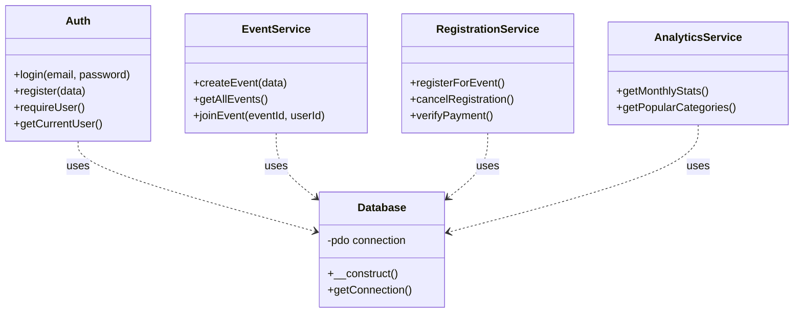

# 🏗️ Dokumen 3: Arsitektur OOP (Object-Oriented Programming)
## Membedah Mesin di Balik EventKu

> **Navigasi Dokumentasi**:
> [🏠 Home](../README.md) | [⚙️ Setup & Install](00_SETUP_AND_INSTALLATION.md) | [📘 Overview](01_PROJECT_OVERVIEW.md) | [📂 Struktur Folder](02_FOLDER_STRUCTURE.md) | [🏗️ Repo-Service Pattern](05_SERVICE_REPOSITORY_PATTERN.md) | [🗄️ Database](06_DATABASE_SCHEMA.md)

---

Project ini bukan sekadar kumpulan skrip PHP biasa. Project ini dibangun dengan arsitektur **Service-Oriented** berbasis Class. Ini adalah standar yang dipakai di dunia kerja profesional (mirip konsep Laravel/Symfony tapi versi Native).

### 1. Konsep Dasar OOP di Sini
Bayangkan kode Anda seperti sebuah **Restoran**:

1.  **View (`public/*.php`) = Pelayan**.
    *   Tugasnya hanya menyapa tamu, menerima pesanan, dan mengantar makanan ke meja.
    *   Dia TIDAK BOLEH memasak. (File View tidak boleh ada query SQL `SELECT * FROM...`).
2.  **Service (`modules/*Service.php`) = Koki**.
    *   Tugasnya memasak. Dia yang tahu resep, takaran bumbu, dan cara motong daging.
    *   Dia menerima pesanan dari Pelayan, memprosesnya, dan memberikan hasilnya balik ke Pelayan.
    *   Di sinilah query SQL (`INSERT`, `UPDATE`, `SELECT`) berada.
3.  **Database Class (`config/database.php`) = Kompor/Gas**.
    *   Alat vital yang dibutuhkan Koki untuk bekerja. Tanpa ini, tidak bisa masak.

---

### 2. Diagram Kelas (Class Diagram)

Berikut adalah visualisasi bagaimana Class-Class di sistem ini saling berhubungan:



Semua Service (Koki) bergantung pada `Database` (Kompor).

---

### 3. Bedah Alur 1 Fitur: "Pendaftaran Event"

Mari kita lihat perjalanan data saat User mengklik tombol **"DAFTAR"**, langkah demi langkah secara OOP:

#### Langkah 1: Pelayan Menerima Request (View)
File: `public/register-event.php`

```php
// 1. Pelayan (View) memanggil Koki (Service)
$registrationService = new RegistrationService();

// 2. Pelayan menerima input User
$userId = $_SESSION['user_id'];
$eventId = $_POST['event_id'];

// 3. Pelayan menyuruh Koki bekerja
$hasil = $registrationService->registerForEvent($userId, $eventId);
```

#### Langkah 2: Koki Bekerja (Service Logic)
File: `modules/registrations/RegistrationService.php`

```php
public function registerForEvent($userId, $eventId) {
    // 1. Koki cek dulu: Emang stok (kuota) masih ada?
    $kuota = $this->db->query("SELECT kuota FROM events WHERE id = $eventId");
    
    // 2. Koki cek: User ini udah pernah makan (daftar) belum?
    $cek = $this->db->query("SELECT * FROM registrations WHERE...");

    if ($kuota > 0 && !$cek) {
        // 3. Masak! (Simpan data pendaftaran)
        $this->db->query("INSERT INTO registrations...");
        
        // 4. Kurangi stok bahan (Update kuota)
        $this->db->query("UPDATE events SET kuota = kuota - 1...");
        
        return ["success" => true]; // "Masakan Jadi!"
    } else {
        return ["success" => false]; // "Bahan habis, Bos!"
    }
}
```

#### Langkah 3: Pelayan Melapor ke User (View)
Kembali ke `public/register-event.php`

```php
if ($hasil['success']) {
    echo "Selamat! Pendaftaran Berhasil."; // Tampilkan pesan sukses
} else {
    echo "Maaf, Kuota Penuh."; // Tampilkan pesan error
}
```

---

### 4. 💡 Panduan Menambah Fitur Baru

Ingin menambahkan fitur? Misal: **"Komentar pada Event"**. Jangan asal tulis kode! Ikuti pola ini:

1.  **Siapkan Database**:
    *   Buat tabel `comments` di database (id, user_id, event_id, isi_komentar).
2.  **Buat Service (Koki)**:
    *   Buat file baru `modules/events/CommentService.php`.
    *   Tulis function `addComment($userId, $eventId, $text)` di situ.
    *   Tulis function `getCommentsByEvent($eventId)` di situ.
3.  **Buat View (Pelayan)**:
    *   Buka `public/event-detail.php`.
    *   Panggil `CommentService`.
    *   Tampilkan form komentar dan list komentar.

Dengan cara ini, kode Anda tetap rapi meskipun fitur bertambah banyak.

---

### 5. Keuntungan Menggunakan Cara Ini

1.  **Mudah Diperbaiki (Debug)**:
    *   Kalau tampilan berantakan -> Cari di file `public/`.
    *   Kalau saldo/kuota salah hitung -> Cari di file `modules/`.
    *   Masalah jadi terisolasi, tidak pusing cari di ribuan baris kode.
2.  **Aman (Security)**:
    *   Hacker tidak bisa menyisipkan kode jahat di SQL (SQL Injection) karena semua Service menggunakan `Prepare Statement`.
3.  **Kerja Tim**:
    *   Satu orang bisa fokus desain tampilan (Frontend) di folder `public`.
    *   Satu orang fokus logika database (Backend) di folder `modules`.

Dokumen ini menjelaskan **"JIWA"** dari source code EventKu. Dengan memahaminya, Anda bukan hanya "bisa coding", tapi "mengerti software engineering".

---
**Dokumentasi Selanjutnya**:
[-> Lihat Spesifikasi Teknis](04_TECHNICAL_SPECIFICATION_REPORT.md)
