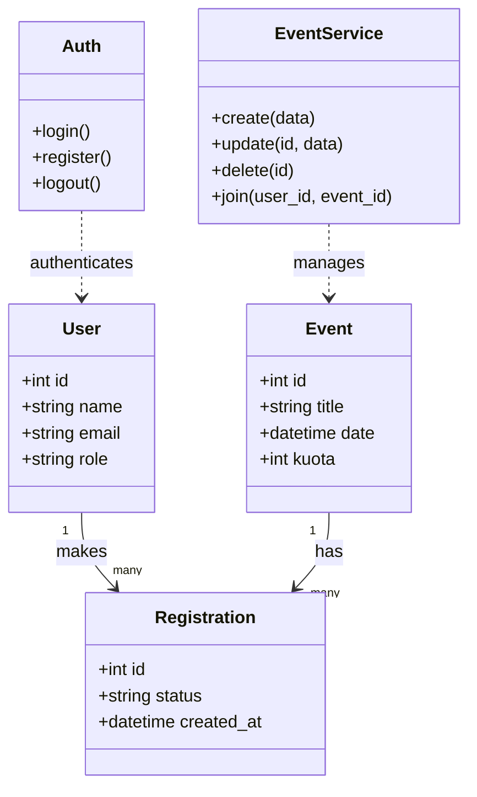
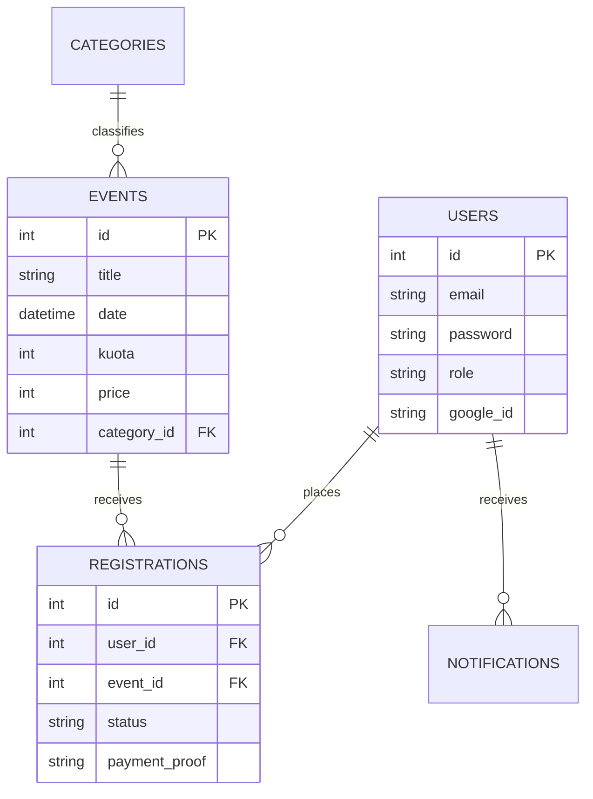

# 📄 Dokumen 4: Technical Specification Report (Laporan Akhir)
## EventKu - Sistem Manajemen Event Mahasiswa

> **Tujuan Dokumen**: Menyajikan spesifikasi teknis lengkap, arsitektur sistem, dan panduan deployment sebagai syarat kelengkapan project akhir.

> **Navigasi Dokumentasi**:
> [🏠 Home](../README.md) | [⚙️ Setup & Install](00_SETUP_AND_INSTALLATION.md) | [📘 Overview](01_PROJECT_OVERVIEW.md) | [🏗️ Repo-Service Pattern](05_SERVICE_REPOSITORY_PATTERN.md) | [🗄️ Database](06_DATABASE_SCHEMA.md)

---

### 1. 🛠️ Teknologi Inti (Core Technology)

Sistem ini dibangun dengan mematuhi batasan teknologi yang ditentukan:

#### A. Backend (Server-Side)
*   **Bahasa**: PHP Native (Versi 8.0+).
    *   *Penjelasan*: Tidak menggunakan framework Full-Stack seperti Laravel/CodeIgniter. Semua logika routing dan kontroler ditulis manual (`Native`) untuk memahami konsep dasar web.
    *   **Architecture**: Service-Oriented (Logic dipisah dalam Class/Object).
*   **Database**: MySQL / MariaDB.
    *   Menggunakan driver `PDO` (PHP Data Objects) untuk keamanan dan portabilitas.

#### B. Frontend (Client-Side)
*   **Framework CSS**: Bootstrap 5.3 + Custom CSS (Glassmorphism UI).
*   **JavaScript Library**:
    *   `Chart.js`: Untuk visualisasi data grafik di Dashboard Admin.
    *   `Leaflet.js`: Untuk peta lokasi event (OpenStreetMap).
*   **Responsiveness**: Mobile-First Design (Cocok untuk HP & Desktop).

#### C. Library & Utilities (Composer)
Framework penuh dilarang, tetapi library utilitas digunakan via **Composer**:
*   `phpmailer/phpmailer`: Untuk mengirim email notifikasi (reset password, tiket).
*   `vlucas/phpdotenv`: Untuk memuat konfigurasi aman dari file `.env`.
*   `google/apiclient`: Untuk integrasi Google Login & Calendar.

---

### 2. 🏗️ Arsitektur & OOP (Object-Oriented Programming)

Sistem ini **SEPENUHNYA** berbasis Class dan Object, menghindari gaya prosedural spaghetti code.

#### A. Struktur Class (Service Pattern)
Logika bisnis tidak dicampur dengan HTML.

*   **Class `Database`**: Singleton pattern untuk koneksi database.
*   **Class `Auth`**: Enkapsulasi logika login/session.
*   **Class `EventService`**: Menangani CRUD event.
*   **Class `RegistrationService`**: Menangani transaksi pendaftaran.

#### B. Diagram ADBO / UML Class Diagram
Visualisasi hubungan antar Class (Object):

---

### 3. 🗄️ Database & ERD (Entity Relationship Diagram)

#### A. Skema Database
*   **Tabel `users`**: Data pengguna & admin.
*   **Tabel `events`**: Data kegiatan.
*   **Tabel `categories`**: Jenis event (Seminar, Musik, dll).
*   **Tabel `registrations`**: Data pendaftar (Foreign Key ke `users` dan `events`).
*   **Tabel `notifications`**: inbox notifikasi user.

#### B. Visualisasi ERD

---

### 4. 🚀 Dokumentasi Deployment & Akun Uji

#### A. Cara Run Lokal (Localhost)
1.  **Clone Repo**: `git clone https://github.com/Leoallogne/fp_event_mahasiswa.git`
2.  **Siapkan Database**:
    *   Buat database baru di phpMyAdmin: `event_management`.
    *   Import file SQL: `database/schema.sql`.
3.  **Setup .env**:
    *   Copy `.env.example` menjadi `.env`.
    *   Isi `DB_PASS` sesuai settingan XAMPP/MAMP Anda.
    *   Isi `GOOGLE_CLIENT_ID` (jika ingin fitur Google login jalan).
4.  **Jalankan**:
    *   Buka browser: `http://localhost/mahasiswa_fp/public`

#### B. Akun Uji (Demo Accounts)
Gunakan akun ini untuk pengujian sistem:

| Role | Email | Password |
| :--- | :--- | :--- |
| **Administrator** | `admin@event.com` | `admin123` |
| **User Biasa** | `user@event.com` | `user123` |
| **User Baru** | *(Silakan Register Sendiri)* | - |

#### C. Daftar Endpoint (Routing)
Karena Native PHP, routing berdasarkan file fisik di folder `public/`:

*   **Public**:
    *   `/` -> Landing Page
    *   `/login.php` -> Halaman Masuk
    *   `/register.php` -> Halaman Daftar
    *   `/dashboard.php` -> Dashboard User
*   **Admin**:
    *   `/admin/dashboard.php` -> Statistik
    *   `/admin/events.php` -> CRUD Event
    *   `/admin/event-participants.php` -> Verifikasi Peserta

---

### 5. 🎨 Mockup Sistem (UI Design)

Desain antarmuka menggunakan gaya **Modern Glassmorphism** (Efek kaca transparan).

#### Halaman Login
*   **Layout**: Split Screen (Kiri: Ilustrasi Event, Kanan: Form Login).
*   **Fitur**: Input Floating Label, Tombol "Sign in with Google" mencolok.

#### Dashboard User
*   **Header**: Navbar transparan dengan Avatar user.
*   **Content**: Card statistik (Event Diikuti), diikuti Grid Card daftar event terbaru.
*   **Detail**: Saat klik event, muncul Modal/Halaman detail dengan Peta Lokasi.

#### Dashboard Admin
*   **Sidebar**: Menu navigasi vertikal di kiri (Dark Mode).
*   **Main Area**:
    *   **Atas**: 3 Kartu Statistik Besar (Total User, Event Aktif, Pendapatan).
    *   **Tengah**: Grafik Chart.js (Kurva pendaftaran per bulan).
    *   **Bawah**: Tabel Event terbaru dengan Badge status.

---

### ✅ Checklist Kelengkapan
*   [x] **Source Code**: Tersedia di GitHub.
*   [x] **Database**: File `database/schema.sql` siap import.
*   [x] **Siap Host**: Folder `public/` terpisah aman.
*   [x] **Dokumen**: Overview, Structure, OOP, & Final Report lengkap.
*   [x] **Fitur**: CRUD, Auth, PDF, Email, Maps berfungsi.

Dokumen ini menyatakan bahwa sistem **EventKu** telah memenuhi seluruh kriteria spesifikasi yang diminta.
