# Use Case Diagram Visual - Admin Module

## Mermaid Diagram

```mermaid
graph TD
    A[Admin] --> B[Authentication]
    A --> C[Dashboard Management]
    A --> D[Event Management]
    A --> E[Category Management]
    A --> F[Participant Management]
    A --> G[Notification Management]
    A --> H[Analytics & Reporting]
    A --> I[User Management]

    B --> B1[Admin Login]
    B --> B2[Admin Logout]

    C --> C1[View Admin Dashboard]

    D --> D1[Create Event]
    D --> D2[View All Events]
    D --> D3[Edit Event]
    D --> D4[Delete Event]
    D --> D5[Publish/Unpublish Event]

    E --> E1[View Categories]
    E --> E2[Create Category]
    E --> E3[Edit Category]
    E --> E4[Delete Category]

    F --> F1[View Event Participants]
    F --> F2[Manage Registration Status]
    F --> F3[Export Participant Data]

    G --> G1[View Notification Log]
    G --> G2[Send Event Reminder]
    G --> G3[Create Custom Notification]

    H --> H1[View System Analytics]
    H --> H2[Generate Reports]
    H --> H3[View Real-time Statistics]

    I --> I1[View All Users]
    I --> I2[Manage User Status]
    I --> I3[View User Activity]

    %% Relationships
    D1 -.-> E1
    D3 -.-> E1
    F1 -.-> D2
    G2 -.-> D2
    C1 -.-> H1
    D2 -.-> SearchFilter
```



## Detailed Use Case Specifications

### UC-ADMIN-04: Create Event

**Preconditions:**

- Admin sudah login
- Admin memiliki hak akses create event
- Kategori event tersedia

**Main Flow:**

1. Admin mengklik tombol "Tambah Event"
2. System menampilkan form create event
3. Admin mengisi form (nama, deskripsi, lokasi, tanggal, kuota, kategori)
4. Admin mengupload gambar event (opsional)
5. Admin mengklik tombol "Simpan"
6. System memvalidasi semua input
7. System menyimpan event ke database
8. System mengupload gambar jika ada
9. System menampilkan pesan sukses
10. Admin diarahkan ke halaman events

**Alternative Flows:**

- 6a: Input tidak valid → System menampilkan error validation
- 7a: Database error → System menampilkan pesan error
- 8a: Upload gagal → System menampilkan pesan error tapi tetap menyimpan event

**Postconditions:**

- Event baru tersimpan di database
- Event dapat dilihat oleh users (jika published)

### UC-ADMIN-17: Send Event Reminder

**Preconditions:**

- Admin sudah login
- Event memiliki peserta yang terdaftar
- Event akan berlangsung dalam waktu dekat

**Main Flow:**

1. Admin mengakses halaman notifications
2. Admin memilih event dari dropdown
3. Admin mengklik tombol "Kirim Reminder"
4. System menampilkan konfirmasi
5. Admin mengkonfirmasi pengiriman
6. System mengambil semua peserta event
7. System membuat notifikasi untuk setiap peserta
8. System mengirim email reminder
9. System mengupdate status notifikasi
10. System menampilkan statistik pengiriman
11. System menampilkan konfirmasi sukses

**Alternative Flows:**

- 6a: Tidak ada peserta → System menampilkan pesan info
- 8a: Email gagal terkirim → System mencatat error dan lanjutkan
- 10a: Semua gagal → System menampilkan pesan error

**Postconditions:**

- Notifikasi terkirim ke semua peserta
- Email reminder terkirim
- Log notifikasi tersimpan

## Class Diagram Overview

```mermaid
classDiagram
    class Admin {
        +int id
        +string nama
        +string email
        +string password
        +string role
        +datetime last_login
        +login()
        +logout()
        +createEvent()
        +manageUsers()
    }

    class Event {
        +int id
        +string nama
        +string deskripsi
        +string lokasi
        +datetime tanggal
        +int kuota
        +string status
        +int category_id
        +int created_by
        +create()
        +update()
        +delete()
        +publish()
    }

    class Category {
        +int id
        +string nama
        +string deskripsi
        +datetime created_at
        +create()
        +update()
        +delete()
        +getEventCount()
    }

    class Registration {
        +int id
        +int user_id
        +int event_id
        +string status
        +datetime created_at
        +approve()
        +reject()
        +cancel()
    }

    class Notification {
        +int id
        +int user_id
        +int event_id
        +string title
        +string message
        +string type
        +string status
        +send()
        +markAsRead()
    }

    class Analytics {
        +int total_events
        +int total_users
        +int total_registrations
        +array monthly_stats
        +getDashboardStats()
        +getEventTrends()
        +getUserEngagement()
    }

    Admin ||--o{ Event : creates
    Admin ||--o{ Category : manages
    Admin ||--o{ Notification : sends
    Event ||--o{ Registration : has
    Event }|--|| Category : belongs_to
    Registration }|--|| User : belongs_to
    Notification }|--|| User : sent_to
    Notification }|--|| Event : about
```

## Database Schema (Admin Tables)

```sql
-- Admin-specific tables (additional to user schema)

-- Categories Table
CREATE TABLE categories (
    id INT PRIMARY KEY AUTO_INCREMENT,
    nama VARCHAR(255) NOT NULL,
    deskripsi TEXT,
    created_at TIMESTAMP DEFAULT CURRENT_TIMESTAMP,
    updated_at TIMESTAMP DEFAULT CURRENT_TIMESTAMP ON UPDATE CURRENT_TIMESTAMP
);

-- Admin Logs Table (for audit trail)
CREATE TABLE admin_logs (
    id INT PRIMARY KEY AUTO_INCREMENT,
    admin_id INT NOT NULL,
    action VARCHAR(255) NOT NULL,
    table_name VARCHAR(100),
    record_id INT,
    old_values JSON,
    new_values JSON,
    created_at TIMESTAMP DEFAULT CURRENT_TIMESTAMP,
    FOREIGN KEY (admin_id) REFERENCES users(id)
);

-- System Settings Table
CREATE TABLE system_settings (
    id INT PRIMARY KEY AUTO_INCREMENT,
    setting_key VARCHAR(255) UNIQUE NOT NULL,
    setting_value TEXT,
    description TEXT,
    updated_by INT,
    updated_at TIMESTAMP DEFAULT CURRENT_TIMESTAMP ON UPDATE CURRENT_TIMESTAMP,
    FOREIGN KEY (updated_by) REFERENCES users(id)
);

-- Email Queue Table
CREATE TABLE email_queue (
    id INT PRIMARY KEY AUTO_INCREMENT,
    to_email VARCHAR(255) NOT NULL,
    subject VARCHAR(255) NOT NULL,
    body TEXT NOT NULL,
    status ENUM('pending', 'sent', 'failed') DEFAULT 'pending',
    attempts INT DEFAULT 0,
    sent_at DATETIME,
    created_at TIMESTAMP DEFAULT CURRENT_TIMESTAMP
);
```

## API Endpoints (Admin)

```
Authentication:
POST /admin/login.php - Admin login
GET /admin/logout.php - Admin logout

Dashboard:
GET /admin/dashboard.php - View admin dashboard

Events:
GET /admin/events.php - View all events
POST /admin/events.php - Create new event
PUT /admin/events.php?id={id} - Update event
DELETE /admin/events.php?id={id} - Delete event
POST /admin/events.php?action=publish&id={id} - Publish event

Categories:
GET /admin/categories.php - View categories
POST /admin/categories.php - Create category
PUT /admin/categories.php?id={id} - Update category
DELETE /admin/categories.php?id={id} - Delete category

Participants:
GET /admin/event-participants.php?id={event_id} - View participants
PUT /admin/event-participants.php?action=update_status - Update registration status
GET /admin/event-participants.php?action=export&id={event_id} - Export data

Notifications:
GET /admin/notifications.php - View notification log
POST /admin/notifications.php?action=send_reminder - Send event reminder
POST /admin/notifications.php?action=custom_notification - Send custom notification

Analytics:
GET /admin/analytics.php - View analytics
GET /admin/analytics.php?action=export - Export analytics data
```

## Security Implementation

- **Role-Based Access Control (RBAC)**: Strict role validation for admin access
- **Session Security**: Secure session management with timeout
- **CSRF Protection**: Token validation for all admin actions
- **Input Validation**: Comprehensive validation and sanitization
- **SQL Injection Prevention**: Prepared statements for all queries
- **Audit Trail**: Complete logging of all admin actions
- **IP Whitelisting**: Optional IP restriction for admin access
- **Two-Factor Authentication**: Optional 2FA for enhanced security

## Performance Optimization

- **Database Indexing**: Optimized indexes for frequent queries
- **Caching Strategy**: Redis caching for dashboard data
- **Lazy Loading**: Pagination for large datasets
- **Background Processing**: Queue system for email sending
- **CDN Integration**: Static assets served via CDN
- **Database Connection Pooling**: Efficient connection management
- **Query Optimization**: Optimized queries for analytics

## Monitoring & Logging

- **Error Logging**: Comprehensive error tracking
- **Performance Monitoring**: Response time tracking
- **User Activity Logging**: Detailed admin action logs
- **System Health Monitoring**: Database and server metrics
- **Security Event Logging**: Failed login attempts, suspicious activities
- **Backup Monitoring**: Automated backup verification

## Testing Strategy

- **Unit Tests**: PHPUnit for business logic
- **Integration Tests**: API endpoint testing
- **Security Tests**: Penetration testing
- **Performance Tests**: Load testing with realistic data
- **UI Tests**: Selenium for critical admin workflows
- **Database Tests**: Migration and schema validation
