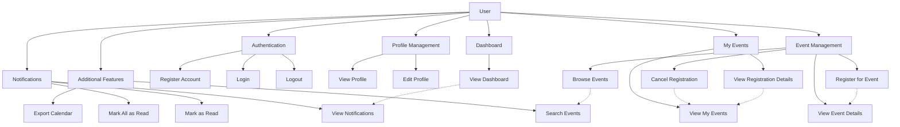

# Use Case Diagram Visual - User Module

## Mermaid Diagram



## Detailed Use Case Specifications

### UC-01: Register Account

**Preconditions:**

- User memiliki email yang valid
- User belum memiliki akun di sistem

**Main Flow:**

1. User membuka halaman registrasi
2. User mengisi form registrasi (nama, email, password, konfirmasi password)
3. User mengklik tombol "Daftar"
4. System memvalidasi input (email format, password strength, required fields)
5. System mengecek apakah email sudah terdaftar
6. System membuat akun baru dengan password hash
7. System mengirim email verifikasi (opsional)
8. System menampilkan pesan sukses
9. User diarahkan ke halaman login

**Alternative Flows:**

- 4a: Input tidak valid → System menampilkan error message
- 5a: Email sudah terdaftar → System menampilkan pesan error
- 6a: Database error → System menampilkan pesan error coba lagi

**Postconditions:**

- Akun user baru tersimpan di database
- User dapat login dengan kredensial yang dibuat

### UC-02: Login

**Preconditions:**

- User memiliki akun yang valid
- User belum login

**Main Flow:**

1. User membuka halaman login
2. User memasukkan email dan password
3. User mengklik tombol "Masuk"
4. System memvalidasi format input
5. System mencari user di database berdasarkan email
6. System memverifikasi password dengan hash
7. System membuat session untuk user
8. System mengarahkan user ke dashboard

**Alternative Flows:**

- 4a: Input kosong → System menampilkan error
- 5a: User tidak ditemukan → System menampilkan error
- 6a: Password salah → System menampilkan error
- 7a: Session error → System menampilkan error

**Postconditions:**

- User berhasil login
- Session aktif untuk user

### UC-08: Register for Event

**Preconditions:**

- User sudah login
- User melihat detail event yang tersedia
- Event masih memiliki kuota
- Batas registrasi belum terlewati

**Main Flow:**

1. User melihat detail event
2. User mengklik tombol "Daftar Event"
3. System menampilkan konfirmasi registrasi
4. User mengkonfirmasi pendaftaran
5. System mengecek apakah user sudah terdaftar
6. System mengecek kuota event
7. System menyimpan registrasi ke database
8. System mengurangi kuota event
9. System mengirim notifikasi ke user
10. System menampilkan pesan sukses

**Alternative Flows:**

- 5a: User sudah terdaftar → System menampilkan pesan info
- 6a: Kuota habis → System menampilkan pesan error
- 7a: Database error → System menampilkan pesan error

**Postconditions:**

- User terdaftar di event
- Kuota event berkurang
- Notifikasi terkirim ke user

## Class Diagram Overview

```mermaid
classDiagram
    class User {
        +int id
        +string nama
        +string email
        +string password
        +string foto
        +datetime created_at
        +register()
        +login()
        +logout()
        +updateProfile()
    }

    class Event {
        +int id
        +string nama
        +string deskripsi
        +string lokasi
        +datetime tanggal
        +int kuota
        +string status
        +getDetails()
        +checkAvailability()
    }

    class Registration {
        +int id
        +int user_id
        +int event_id
        +string status
        +datetime created_at
        +register()
        +cancel()
    }

    class Notification {
        +int id
        +int user_id
        +int event_id
        +string message
        +string status
        +datetime created_at
        +markAsRead()
        +send()
    }

    User ||--o{ Registration : registers
    Event ||--o{ Registration : has
    User ||--o{ Notification : receives
    Event ||--o{ Notification : triggers
```

## Database Schema

```sql
-- Users Table
CREATE TABLE users (
    id INT PRIMARY KEY AUTO_INCREMENT,
    nama VARCHAR(255) NOT NULL,
    email VARCHAR(255) UNIQUE NOT NULL,
    password VARCHAR(255) NOT NULL,
    foto VARCHAR(255),
    role ENUM('user', 'admin') DEFAULT 'user',
    created_at TIMESTAMP DEFAULT CURRENT_TIMESTAMP
);

-- Events Table
CREATE TABLE events (
    id INT PRIMARY KEY AUTO_INCREMENT,
    nama VARCHAR(255) NOT NULL,
    deskripsi TEXT,
    lokasi VARCHAR(255) NOT NULL,
    tanggal DATETIME NOT NULL,
    kuota INT DEFAULT 0,
    status ENUM('draft', 'published', 'cancelled') DEFAULT 'draft',
    created_by INT,
    created_at TIMESTAMP DEFAULT CURRENT_TIMESTAMP,
    FOREIGN KEY (created_by) REFERENCES users(id)
);

-- Registrations Table
CREATE TABLE registrations (
    id INT PRIMARY KEY AUTO_INCREMENT,
    user_id INT NOT NULL,
    event_id INT NOT NULL,
    status ENUM('pending', 'confirmed', 'cancelled') DEFAULT 'confirmed',
    created_at TIMESTAMP DEFAULT CURRENT_TIMESTAMP,
    FOREIGN KEY (user_id) REFERENCES users(id),
    FOREIGN KEY (event_id) REFERENCES events(id),
    UNIQUE KEY unique_registration (user_id, event_id)
);

-- Notifications Table
CREATE TABLE notifications (
    id INT PRIMARY KEY AUTO_INCREMENT,
    user_id INT NOT NULL,
    event_id INT,
    title VARCHAR(255),
    message TEXT,
    status ENUM('pending', 'sent') DEFAULT 'pending',
    created_at TIMESTAMP DEFAULT CURRENT_TIMESTAMP,
    sent_time DATETIME,
    FOREIGN KEY (user_id) REFERENCES users(id),
    FOREIGN KEY (event_id) REFERENCES events(id)
);
```

## API Endpoints

```
Authentication:
POST /register.php - Register new user
POST /login.php - User login
GET /logout.php - User logout

Profile:
GET /profile.php - View profile
POST /profile.php - Update profile

Events:
GET /index.php - Browse events
GET /event-detail.php?id={id} - View event details
POST /register-event.php - Register for event
POST /cancel-registration.php - Cancel registration

User Events:
GET /my-events.php - View user's events

Dashboard:
GET /dashboard.php - View dashboard

Notifications:
GET /notifications.php - View notifications
POST /notifications.php - Mark as read

Additional:
GET /export-calendar.php - Export calendar
```

## Security Considerations

- **Password Security**: Hashing dengan bcrypt, minimum 8 karakter
- **Session Management**: Secure session dengan timeout
- **Input Validation**: Sanitasi semua user input
- **SQL Injection**: Prepared statements untuk semua query
- **XSS Protection**: Output escaping dengan htmlspecialchars
- **CSRF Protection**: Token untuk form submissions

## Performance Metrics

- **Login Time**: <2 seconds
- **Dashboard Load**: <3 seconds
- **Event Registration**: <1 second
- **Notification Delivery**: <5 seconds
- **Concurrent Users**: Support 1000+ users

## Testing Strategy

- **Unit Tests**: PHP Unit untuk business logic
- **Integration Tests**: API endpoint testing
- **UI Tests**: Selenium untuk critical user flows
- **Performance Tests**: Load testing dengan JMeter
- **Security Tests**: OWASP ZAP scanning
